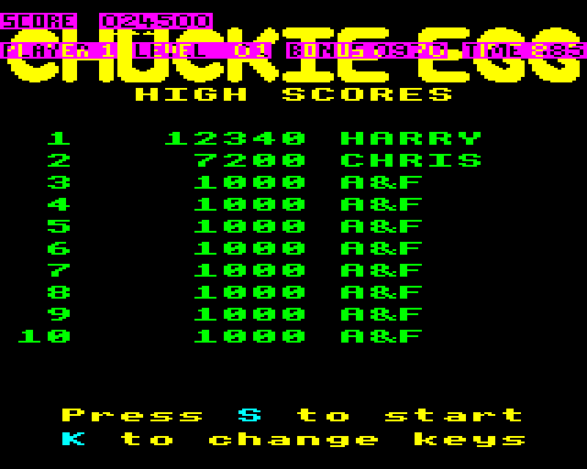
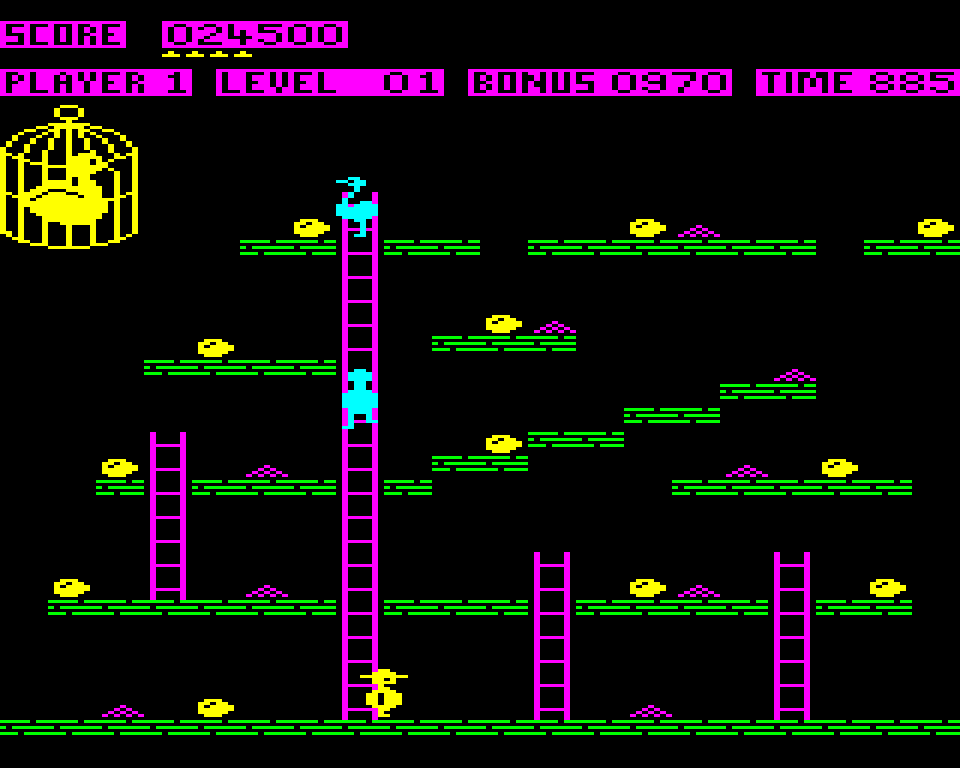

# Chuckie Egg

A faithful recreation of the 1983 BBC Micro 32K game **Chuckie Egg**, built in
[Godot 4.7](https://godotengine.org/) with typed GDScript.




The goal is accuracy rather than reinterpretation: the original's integer movement
arithmetic, tile layouts, colours and timing are reproduced as they were, not re-tuned to
feel modern. Where the original does something odd — moving two units vertically per frame,
letting an egg overwrite the platform beneath it — that behaviour is preserved deliberately.

**Status: playable.** All eight layouts, one to four players, hens, lifts, the mother duck,
synthesised sound, high scores, key remapping, gamepad support and the screens between. The
export builds are what remain — see [ROADMAP.md](ROADMAP.md).

---

## Running it

Requires Godot 4.7 or newer. No addons, no external dependencies.

```sh
godot                      # open the project
godot scenes/main.tscn     # or run the current scene directly
```

The window opens at 960 × 768 (3× integer scale of the native 320 × 256 canvas).

## Controls

| | Keyboard | Gamepad |
|---|---|---|
| Move | Arrow keys | D-pad or left stick |
| Jump | Space | A |
| Start the game | `S` | A or Start |
| Player count | `1`–`4` | D-pad left/right, A to confirm |
| Change keys | `K` | — |
| Hold | `H` | — |
| Abort to title | `Escape` + `H` | — |

Movement and jump are rebindable from the `K` screen and persist to `user://keys.cfg`. The
gamepad mapping is fixed.

### Deliberate deviations

The original is followed closely elsewhere (see [CLAUDE.md](CLAUDE.md)), so the departures
here are worth stating:

- **Only `H` and `Escape` are reserved.** The original hardwires its front-end keys as scan
  codes, so `S`, `K` and `1`–`4` can never be bound to a control. This version reserves only
  the two keys it reads *while the game is running* — `H` for hold and `Escape` for the
  `Escape`+`H` abort. The others belong to screens Harry is not on, and the front end is
  edge-triggered, so a key held across a screen change cannot leak into the next one.
  **This is an intentional change**: it is what makes `S`, and therefore WASD, bindable.
- **The player-select screen shows the four counts**, with the current one highlighted. The
  original asks the question and silently accepts a bare digit, which a gamepad cannot
  produce.
- **Gamepad support** has no counterpart at all in a 1983 BBC game.
- **A direction pressed a tick or two after the jump still counts.** The original fixes the
  jump's direction at take-off and so does this, but its jump button is level-triggered, so a
  mistimed jump self-corrected on the next automatic hop. Requiring a fresh press — which the
  ROM itself intended — removed that, leaving a coin flip on which key landed in the tick
  first. The direction is now adopted for the first two ticks of a jump that has none.
  Steering or reversing in mid-air remains impossible, exactly as in the original.
- Arrow keys are the movement default. The original's defaults are its own letter keys, which
  would be an odd thing to inflict on a modern player.

## Project layout

```
assets/Sprites/      Aseprite sources — the art's source of truth
assets/generated/    PNGs used by the game (committed; mostly decoded from Sprites/)
levels/              LevelData resources, one per layout
scenes/              Godot scenes
scripts/             Game code
tools/               Asset and data conversion scripts
docs/                Screenshots
CLAUDE.md            The authoritative technical spec
ROADMAP.md           Milestone tracker
```

## Tooling

Godot cannot import `.aseprite` files, and the usual importer addons shell out to the
Aseprite binary. Rather than depend on that, `tools/aseprite_to_png.py` decodes the format
directly — pure Python standard library, no Aseprite install required.

```sh
python3 tools/aseprite_to_png.py     # assets/Sprites/*.aseprite -> assets/generated/*.png
python3 tools/leveldata_to_tres.py   # reference leveldata.c   -> levels/level_1..8.tres
python3 tools/rom_to_aseprite.py     # repair an .aseprite from its ROM bitmap
python3 tools/rom_hud_to_png.py      # HUD glyphs and the closed cage, from the ROM
python3 tools/rom_banner_to_png.py   # the CHUCKIE EGG title letters
python3 tools/yaff_to_png.py         # the BBC OS font, for the message screens
python3 tools/font_sheet_to_png.py   # that font packed into one sheet, for the web pages
python3 tools/build_splash.py        # the boot splash, composed from the game's own sprites
```

All are idempotent and their output is committed, so none is needed for a normal build —
re-run them only after editing the art or revisiting the source data.

Some of the original's artwork has no Aseprite counterpart, because it was never drawn: the
HUD's digits and labels, the closed cage, and the title letters are all ROM bitmaps. Those
tools emit them directly, and the results are the only things under `assets/generated/` with
no `.aseprite` source.

**Sound is not sampled at all.** `BbcSound` synthesises every effect at runtime from the
original's own SOUND and ENVELOPE parameters, because the movement beep changes pitch every
tick — a jump sweeps, and a long fall descends further than a short one.

## A note on the display

The BBC ran this in MODE 2, whose pixels are **twice as wide as they are tall**. The
reference implementation renders into a 160 × 256 framebuffer of those wide pixels; the
Aseprite art here is already horizontally doubled, giving a **320 × 256 square-pixel**
canvas with 16 × 8 tiles. The HUD occupies rows 0–55 and the play area rows 56–255.

That 2:1 pixel is also why the original moves 1 unit horizontally but 2 vertically per
frame — motion is isotropic in square-pixel space. Full details in
[CLAUDE.md](CLAUDE.md).

---

## Credits

**The original game.** *Chuckie Egg*, published by **A&F Software** in 1983.

- The original **ZX Spectrum 48K** version was written by **Nigel Alderton**.
- The **BBC Micro 32K** version — the one this project recreates — was written by
  **Doug Anderson**, also released in 1983.

**The reference implementation.** This conversion is based on
**[pbrook/Chuckie-Egg](https://github.com/pbrook/Chuckie-Egg)** by **Paul Brook** — an
authentic C/SDL clone of the BBC game, licensed GPL-3.0. It is the source of:

- the eight level layouts (`leveldata.c` → `levels/*.tres`)
- the game logic being ported, including movement, collision and difficulty progression (`chuckie.c`)
- sprite bitmaps used to verify our decoded art and derive its draw offsets (`spritedata.c`)
- draw positions and the colour palette (`raster_4bit.c`, `sdl.c`)

That work made this project tractable, and this recreation would not be accurate without it.

**The disassembly.** Where the reference implementation leaves a stub — the tunes, the high
score table, the front-end screens — the details come from
**[mungre/chuckie](https://github.com/mungre/chuckie)**, an annotated disassembly of the BBC
release. No ROM is redistributed here.

**The message font.** The game has no font of its own; its messages went through the BBC's OS
font. That comes from **[robhagemans/hoard-of-bitfonts](https://github.com/robhagemans/hoard-of-bitfonts)**,
a bitmap-font preservation project, whose `LICENSE.md` sets out its position on typeface
copyright and dedicates the author's own work under CC0.

**Reference material.** [chuckieegg.org](https://chuckieegg.org/chuckie-egg/) — *The Chuckie
Egg Professional's Resource Kit*, used for level layouts, character behaviour and gameplay
details.

## Licence

Licensed under the **GNU General Public License v3.0** — see [LICENSE](LICENSE).

This project is a derivative work of [pbrook/Chuckie-Egg](https://github.com/pbrook/Chuckie-Egg),
which is GPL-3.0. Level data is derived from it and game logic is ported from it, so this
project inherits that licence; GPL-3.0 is a requirement here, not merely a preference.

*Chuckie Egg* and any associated trade marks remain the property of their respective owners.
This is a non-commercial fan recreation, made out of respect for the original, and is not
affiliated with or endorsed by A&F Software.
